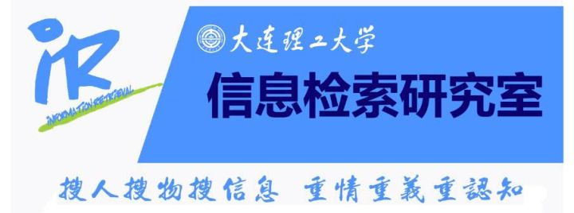

# Python NLP Reading Group
新搜索组，python 自然语言处理读书会。

活动形式：每人挑选Python NLP书中一章节进行讲解，并对代码进行实现，主讲活动之后将本次主讲的内容整理为报告进行上传。

# 项目结构

```
|--base
|--Chapter 1
	|--code.ipynb
	|--report.md
	|--report.docx
|--Chapter 2
...
...
|--Chapter 11
```

# 其他

python版本请选择python3进行代码的编写。

请使用ipython notebook进行代码实践，便于后续交流使用。

另外各个项目中的```report.md```文件请改为```README.md```便于进行查看。

# Who R We?

